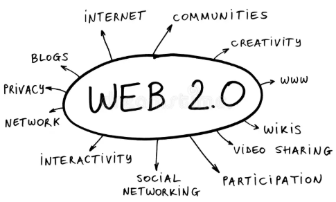
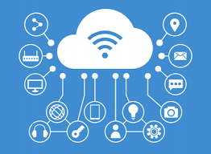

## La *Web 2.0*

&nbsp;&nbsp;&nbsp;&nbsp;&nbsp;&nbsp;&nbsp;&nbsp;&nbsp;&nbsp;&nbsp;&nbsp;&nbsp;&nbsp;&nbsp;

`📌 El término 'Web 2.0' o 'Web social'​ comprende aquellos sitios web que facilitan compartir información: es decir, que permite a los usuarios interactuar y colaborar entre sí como creadores de contenido.`

`💡 Supone un paso adelante en la evolución de Internet para incorporar al usuario como un agente activo en su funcionamiento, y no como un mero cliente o receptor de la información.`

---

### 1. Almacenamiento en la nube o "_cloud_"

Los servidores en la nube han adquirido una gran popularidad en los últimos años, tanto en las áreas profesionales como en la vida personal. Por esto es importante conocer qué es la "nube" en _Internet_.

---

**¿Qué es la nube?**

La nube o “cloud computing” permite almacenar y acceder a datos a través de Internet en lugar del disco duro del ordenador. Es decir, es un nuevo modelo de uso de los equipos en informática: los archivos o programas que antes se almacenaban en el PC, ahora pasan a estar en servidores en la nube.

Los tres tipos de nubes que existen son:

- Nube pública: este tipo de nube ofrece sus servicios a cualquier usuario de internet. Los clientes pagan por el espacio de almacenamiento que necesitan. 

- Nube privada: en este caso se ofrecen los servicios a un número limitado de usuarios a través de las redes empresariales. 

- Nube híbrida: en este caso se almacenan datos en nubes públicas o privadas en función de las necesidades. 

---

**¿Cómo funciona la nube de _Internet_?**

🔐 Para entrar en cualquier tipo de servidor necesitas identificarte con un nombre de `usuario` y `contraseña`. Los datos no se guardan en los equipos, si no que como ya hemos comentado, todo se guarda en un servidor web. 

    ¡Esto permite acceder desde cualquier lugar y con cualquier dispositivo que tenga conexión a Internet! 📺📱🖥️

💾 En la nube todo lo que escribes se guarda automáticamente, lo que disminuye las pérdidas de información.

🌎 En definitiva, el usuario entra en Internet y abre la plataforma de almacenamiento con la que cuenta, de manera que puede visualizar los archivos que ha almacenado previamente en un servidor de cualquier parte del mundo. 

---

**Ejemplos de nube en informática**

A continuación, mostramos algunos ejemplos de nube que existen en la actualidad:

- _Microsoft OneDrive_: es la plataforma en la nube pública de Microsoft. 

- _Google Drive_: es una agrupación de distintos servicios de Google en una misma plataforma.

- _Dropbox_ ò _MEGA_: funcionan como cualquier carpeta de nuestro ordenador, pero con sus servidores en la nube. De esta manera, podemos guardar en _Dropbox_ ò _MEGA_ cualquier tipo de archivo.

- _iCloud_: es un servicio en la nube para usuarios de _Apple_.

---

### 2. Guardado de la información en la nube

---

### 3. Creación de entornos colaborativos

- Servicios de _M365/Google_: creando carpetas compartidas en _Drive_.